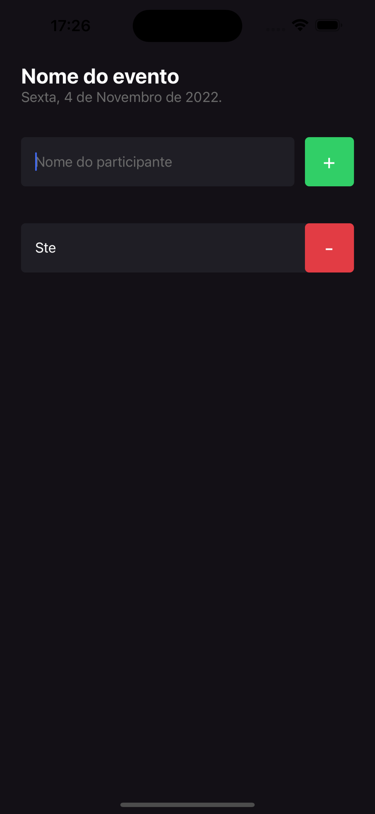

## 💻 Sobre o projeto

<i>Esse projeto foi desenvolvido para reforçar os conceitos mais importantes do React Native com a nova atualizaçao da Trilha de React Native 2022 da Rocketseat. </i>

</br>

<b> Foi desenvolvido uma aplicação para gerenciar uma lista de participantes para eventos </b> 

</br>

<div>
    
    
    
</div>

</br>


## 📝 O que aprendemos

- O que é React Native
    - Quem usa React Native?
    - O que é expo?
- Criar um projeto do zero
    - Estrutura de pastas e arquivos
    - Executar o projeto
- Funcionamento do React Native
    - Refresh e Reload
    - JSX
- Estilização de Elementos
    - Densidade de pixel
    - StyleSheet
    - Flex Direction
- Organização do Projeto
- Export e Export Default
- Componentes
    - TextInput
    - TouchableOpacity
    - Criando um COmponente
    - Propriedades
    - StatusBar
    - Listas
        - ScrollView
        - FlatList
- Alert
- Hooks
    - Conceito de Hooks
    - useState
    - Imutabilidade
    - State e TextInput
    - Render
    - Manipulação de Estados
    - Estado Assíncrono

</br>

---

</br>

## 📁 Como baixar o projeto

</br>

```bash
# Clonando o repositório
$ git clone https://github.com/steephanie/ignite-rn-01-im-here
# Acesse a pasta do projeto no seu terminal
$ cd ignite-rn-01-im-here
# Instale as dependências
$ npm install
# Com o celular e o computador  conectados na mesma rede, execute a aplicação em modo de desenvolvimento
$ expo start
# No app Expo GO, basta ler o QR Code gerado no terminal ou seguir as instruções da tela
``` 
